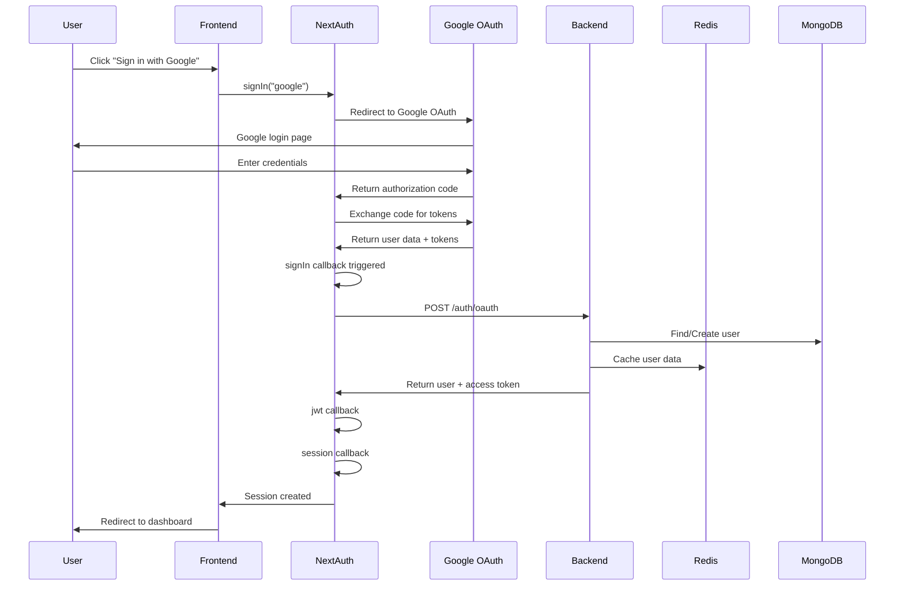
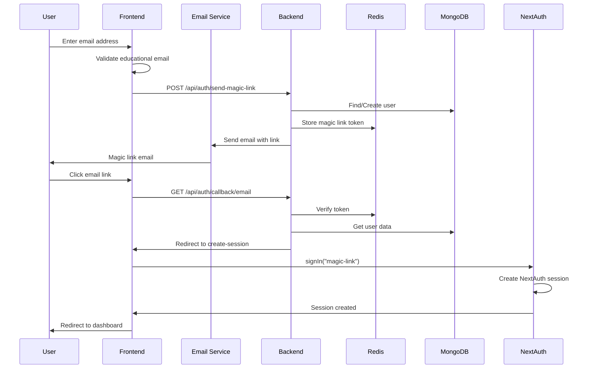

# 🔐 AUTHENTICATION SYSTEM - DETAILED FLOW ANALYSIS

## 📋 **Tổng quan hệ thống**

StudyHub sử dụng **dual authentication system** với 2 phương thức hoàn toàn khác biệt:

### **1. Google OAuth Authentication** 🔗
- **Đối tượng**: Tất cả users (students, staff, public)
- **Cơ chế**: OAuth 2.0 với Google
- **Token flow**: Google → NextAuth → Backend → JWT Session

### **2. Magic Link Authentication** ✨
- **Đối tượng**: Chỉ student emails (educational domains)
- **Cơ chế**: Passwordless email-based authentication
- **Token flow**: Email → Backend → NextAuth → JWT Session

---

## 🔗 **1. GOOGLE OAUTH FLOW - CHI TIẾT**

### **🔄 Flow Diagram:**


### **📝 Chi tiết từng bước:**

#### **Bước 1: User Click Google Sign In**
```typescript
// frontend/app/(auth)/sign-in/page.tsx
const handleGoogleSignIn = async () => {
    setOauthLoading('google');
    try {
        // Gọi NextAuth signIn với provider "google"
        await signIn("google", { callbackUrl: "/" });
    } catch (error: any) {
        toast.error("Google sign-in failed.");
        setOauthLoading(null);
    }
};
```

#### **Bước 2: NextAuth Redirect to Google**
```typescript
// frontend/app/api/auth/[...nextauth]/route.ts
GoogleProvider({
    clientId: process.env.GOOGLE_CLIENT_ID!,
    clientSecret: process.env.GOOGLE_CLIENT_SECRET!,
})
```
- NextAuth redirect user đến Google OAuth consent screen
- Google hiển thị login page và permission request
- User đăng nhập và authorize ứng dụng

#### **Bước 3: Google Return Authorization Code**
```typescript
// Google trả về:
{
    code: "4/0AfJohXn...", // Authorization code
    scope: "openid email profile",
    authuser: "0",
    prompt: "consent"
}
```

#### **Bước 4: NextAuth Exchange Code for Tokens**
```typescript
// NextAuth tự động exchange code lấy tokens
const tokens = await oauthClient.getToken(code);
// Kết quả:
{
    access_token: "ya29.a0AfH6SMC...",
    refresh_token: "1//04dX...",
    scope: "openid email profile",
    token_type: "Bearer",
    expiry_date: 1234567890
}
```

#### **Bước 5: NextAuth Fetch User Data**
```typescript
// NextAuth gọi Google API với access token
const userInfo = await fetch('https://www.googleapis.com/oauth2/v2/userinfo', {
    headers: { Authorization: `Bearer ${access_token}` }
});
// Kết quả:
{
    id: "123456789",
    email: "student@senecacollege.ca",
    verified_email: true,
    name: "John Doe",
    given_name: "John",
    family_name: "Doe",
    picture: "https://lh3.googleusercontent.com/...",
    locale: "en"
}
```

#### **Bước 6: NextAuth signIn Callback Triggered**
```typescript
// frontend/app/api/auth/[...nextauth]/route.ts
async signIn({ user, account, profile }: any) {
    console.log("SignIn callback - user:", user);

    if (account?.provider === "google") {
        try {
            console.log("🔄 Making OAuth API call to backend...");
            
            // Gọi backend API để sync user data
            const response = await fetch(`${process.env.NEXT_PUBLIC_API_URL}/auth/oauth`, {
                method: "POST",
                headers: { "Content-Type": "application/json" },
                body: JSON.stringify({
                    provider: "google",
                    email: user.email,
                    fullName: user.name,
                    profilePic: user.image,
                    providerId: account.providerAccountId
                })
            });

            if (!response.ok) {
                console.error("❌ OAuth API response not OK:", response.status);
                return false;
            }

            const data = await response.json();
            
            if (data.success && data.user && data.token) {
                console.log("✅ OAuth API success - Verification status:", data.user.verificationStatus);
                
                // Store backend data trong user object
                (user as any).backendData = {
                    ...data.user,
                    accessToken: data.token // Store access token từ backend
                };
                return true;
            } else {
                console.error("❌ OAuth API returned success=false:", data);
                return false;
            }
        } catch (error) {
            console.error("❌ OAuth API error:", error);
            return false;
        }
    }
    return true;
}
```

#### **Bước 7: Backend OAuth Handler**
```typescript
// backend/src/controllers/auth.controllers.ts
export const handleOAuth = async (req: Request, res: Response): Promise<void> => {
    try {
        const { provider, email, fullName, profilePic, providerId } = req.body;

        const normalizedEmail = email.toLowerCase().trim();

        // Detect educational email
        const emailDetection = detectEducationalEmail(normalizedEmail);
        const institutionInfo = getInstitutionFromEmail(normalizedEmail);
        
        // Check if user exists
        let user = await User.findOne({ email: normalizedEmail });

        if (!user) {
            // Create new user
            user = new User({
                email: normalizedEmail,
                fullName,
                profilePic,
                provider: 'google',
                providerId,
                isVerified: emailDetection.isEducational, // Auto-verify edu emails
                verificationStatus: emailDetection.isEducational ? 'verified' : 'unverified',
                verificationMethod: 'oauth',
                institutionInfo: emailDetection.isEducational ? institutionInfo : null,
                role: emailDetection.isEducational ? 'student' : 'user'
            });
            await user.save();
        } else {
            // Update existing user
            user.fullName = fullName;
            user.profilePic = profilePic;
            user.provider = 'google';
            user.providerId = providerId;
            user.lastLogin = new Date();
            await user.save();
        }

        // Generate JWT tokens
        const sessionId = generateSessionId();
        const tokens = await generateTokenPair(user._id.toString(), sessionId);

        // Cache user data
        await cacheUser(user._id.toString(), user);

        res.json({
            success: true,
            message: "OAuth authentication successful",
            data: {
                user: {
                    _id: user._id,
                    email: user.email,
                    fullName: user.fullName,
                    isVerified: user.isVerified,
                    verificationStatus: user.verificationStatus,
                    institutionInfo: user.institutionInfo,
                    role: user.role
                },
                token: tokens.accessToken // Return access token
            }
        });

    } catch (error: any) {
        logger.error("OAuth handler error:", error);
        res.status(500).json({
            success: false,
            message: "OAuth authentication failed"
        });
    }
};
```

#### **Bước 8: NextAuth JWT Callback**
```typescript
// frontend/app/api/auth/[...nextauth]/route.ts
async jwt({ token, user, account }: any) {
    // Store backend data trong JWT token
    if (user?.backendData) {
        const backendData = user.backendData;
        token.isOnboarded = backendData.isOnboarded;
        token.isVerified = backendData.isVerified;
        token.verificationStatus = backendData.verificationStatus;
        token.verificationMethod = backendData.verificationMethod;
        token.institutionInfo = backendData.institutionInfo;
        token.role = backendData.role;
        token.bio = backendData.bio;
        token.location = backendData.location;
        token.accessToken = backendData.accessToken; // Store backend access token
    }
    
    return token;
}
```

#### **Bước 9: NextAuth Session Callback**
```typescript
// frontend/app/api/auth/[...nextauth]/route.ts
async session({ session, token }: any) {
    if (session.user && token) {
        session.user.id = token.sub;
        
        // Add verification status từ token data
        session.user.isOnboarded = token.isOnboarded || false;
        session.user.isVerified = token.isVerified || false;
        session.user.verificationStatus = token.verificationStatus || 'unverified';
        session.user.verificationMethod = token.verificationMethod || 'none';
        session.user.institutionInfo = token.institutionInfo || null;
        session.user.role = token.role || 'student';
        session.user.bio = token.bio || '';
        session.user.location = token.location || '';
        
        // Add access token từ backend
        if (token.accessToken) {
            session.accessToken = token.accessToken;
        }
    }
    return session;
}
```

#### **Bước 10: Session Created & Redirect**
- NextAuth tạo JWT session với tất cả backend data
- User được redirect đến dashboard
- Session được lưu trong browser cookies

---

## ✨ **2. MAGIC LINK FLOW - CHI TIẾT**

### **🔄 Flow Diagram:**


### **📝 Chi tiết từng bước:**

#### **Bước 1: User Enter Email**
```typescript
// frontend/app/(auth)/sign-in/page.tsx
const handleEmailChange = (e: React.ChangeEvent<HTMLInputElement>) => {
    const emailValue = e.target.value;
    setEmail(emailValue);
    if (emailValue) validateEmail(emailValue);
    else setEmailValidation({ isValid: false, isEducational: false });
};

const validateEmail = (email: string) => {
    const emailRegex = /^[^\s@]+@[^\s@]+\.[^\s@]+$/;
    const isValid = emailRegex.test(email);
    
    // Educational domains detection
    const eduDomains = [
        'senecacollege.ca', 'georgebrown.ca', 'humber.ca',
        'centennialcollege.ca', 'torontomu.ca', 'yorku.ca',
        'utoronto.ca', '.edu', '.ac.ca'
    ];
    
    const normalizedEmail = email.toLowerCase();
    const isEducational = eduDomains.some(domain => 
        normalizedEmail.includes(domain.toLowerCase())
    );

    setEmailValidation({ isValid, isEducational });
};
```

#### **Bước 2: Frontend Send Magic Link Request**
```typescript
// frontend/app/(auth)/sign-in/page.tsx
const handleMagicLinkSignIn = async (e: React.FormEvent) => {
    e.preventDefault();
    
    if (!emailValidation.isValid) {
        toast.error("Please enter a valid email address");
        return;
    }

    // Chỉ cho phép educational emails
    if (!emailValidation.isEducational) {
        toast.error("Magic link is only available for student emails. Please use Google sign-in instead.");
        return;
    }

    setIsPending(true);

    try {
        // Gọi custom API thay vì NextAuth
        const response = await fetch('/api/auth/send-magic-link', {
            method: 'POST',
            headers: { 'Content-Type': 'application/json' },
            body: JSON.stringify({
                email: email,
                callbackUrl: '/dashboard',
                baseUrl: window.location.origin
            })
        });

        const data = await response.json();

        if (!response.ok || !data.success) {
            throw new Error(data.message || 'Failed to send magic link');
        }

        toast.success("Magic link sent! Check your email inbox.");
        
    } catch (error: any) {
        toast.error(error.message || "Failed to send magic link. Please try again.");
    } finally {
        setIsPending(false);
    }
};
```

#### **Bước 3: Backend Send Magic Link Handler**
```typescript
// backend/src/controllers/auth.controllers.ts
export const sendMagicLink = async (req: Request, res: Response): Promise<void> => {
    try {
        const { email, callbackUrl, baseUrl } = req.body;
        const normalizedEmail = email.toLowerCase().trim();

        // Validate educational email
        const emailDetection = detectEducationalEmail(normalizedEmail);
        if (!emailDetection.isEducational) {
            res.status(400).json({
                success: false,
                message: "Magic link is only available for educational emails"
            });
            return;
        }

        // Find or create user
        let user = await User.findOne({ email: normalizedEmail });
        
        if (!user) {
            const institutionInfo = getInstitutionFromEmail(normalizedEmail);
            user = new User({
                email: normalizedEmail,
                isVerified: true, // Auto-verify educational emails
                verificationStatus: 'verified',
                verificationMethod: 'email',
                institutionInfo,
                role: 'student'
            });
            await user.save();
        }

        // Generate secure magic link token
        const token = generateSecureToken(32);
        const expiryTime = Date.now() + (10 * 60 * 1000); // 10 minutes

        // Store token in Redis
        await redis.setex(`magic:${token}`, 600, JSON.stringify({
            userId: user._id.toString(),
            email: normalizedEmail,
            createdAt: Date.now()
        }));

        // Create magic link URL
        const magicLink = `${baseUrl}/api/auth/callback/email?token=${token}&email=${encodeURIComponent(normalizedEmail)}`;

        // Send email
        await sendEmail({
            to: normalizedEmail,
            subject: "Sign in to StudyHub",
            template: 'magic-link',
            data: {
                name: user.fullName || 'Student',
                magicLink,
                expiryMinutes: 10,
                institution: user.institutionInfo?.name || 'your institution'
            }
        });

        res.json({
            success: true,
            message: "Magic link sent successfully"
        });

    } catch (error: any) {
        logger.error("Magic link send error:", error);
        res.status(500).json({
            success: false,
            message: "Failed to send magic link"
        });
    }
};
```

#### **Bước 4: Email Delivery**
```typescript
// backend/src/utils/email.utils.ts
export const sendEmail = async ({ to, subject, template, data }: EmailParams) => {
    const transporter = nodemailer.createTransporter({
        host: process.env.SMTP_HOST,
        port: parseInt(process.env.SMTP_PORT || '587'),
        secure: false,
        auth: {
            user: process.env.SMTP_USER,
            pass: process.env.SMTP_PASS
        }
    });

    const htmlContent = emailTemplates[template](data);

    await transporter.sendMail({
        from: `"StudyHub" <${process.env.SMTP_USER}>`,
        to,
        subject,
        html: htmlContent
    });
};

// Email template
const emailTemplates = {
    'magic-link': (data: any) => `
        <div style="font-family: Arial, sans-serif; max-width: 600px; margin: 0 auto;">
            <h2>Welcome to StudyHub! 🎓</h2>
            <p>Hi ${data.name},</p>
            <p>Click the button below to sign in to your StudyHub account:</p>
            <a href="${data.magicLink}" style="background: #007bff; color: white; padding: 12px 24px; text-decoration: none; border-radius: 5px; display: inline-block;">
                Sign In to StudyHub
            </a>
            <p><strong>This link will expire in ${data.expiryMinutes} minutes.</strong></p>
            <p>If you didn't request this email, you can safely ignore it.</p>
        </div>
    `
};
```

#### **Bước 5: User Click Email Link**
```typescript
// frontend/app/api/auth/callback/email/route.ts
export async function GET(request: NextRequest) {
    try {
        const { searchParams } = new URL(request.url);
        const token = searchParams.get('token');
        const email = searchParams.get('email');

        if (!token || !email) {
            return NextResponse.redirect(new URL('/auth/signin?error=invalid_link', request.url));
        }

        // Verify magic link với backend
        const response = await fetch(`${process.env.NEXT_PUBLIC_API_URL}/auth/magic-link-verify`, {
            method: 'POST',
            headers: { 'Content-Type': 'application/json' },
            body: JSON.stringify({ email, token })
        });

        const data = await response.json();

        if (!response.ok || !data.success) {
            return NextResponse.redirect(new URL('/auth/signin?error=verification_failed', request.url));
        }

        // Create session data
        const sessionData = {
            user: data.user,
            token: data.token,
            verified: true,
            timestamp: Date.now()
        };

        // Encode session data
        const encodedSessionData = btoa(JSON.stringify(sessionData));

        // Redirect to create-session page
        return NextResponse.redirect(
            new URL(`/auth/create-session?data=${encodedSessionData}`, request.url)
        );

    } catch (error) {
        return NextResponse.redirect(new URL('/auth/signin?error=callback_error', request.url));
    }
}
```

#### **Bước 6: Backend Verify Magic Link**
```typescript
// backend/src/controllers/auth.controllers.ts
export const verifyMagicLink = async (req: Request, res: Response): Promise<void> => {
    try {
        const { email, token } = req.body;
        const normalizedEmail = email.toLowerCase().trim();

        // Get token from Redis
        const tokenData = await redis.get(`magic:${token}`);
        
        if (!tokenData) {
            res.status(400).json({
                success: false,
                message: "Invalid or expired magic link"
            });
            return;
        }

        const parsedTokenData = JSON.parse(tokenData);
        
        // Verify email matches
        if (parsedTokenData.email !== normalizedEmail) {
            res.status(400).json({
                success: false,
                message: "Email mismatch"
            });
            return;
        }

        // Check expiry
        if (Date.now() - parsedTokenData.createdAt > 10 * 60 * 1000) {
            await redis.del(`magic:${token}`);
            res.status(400).json({
                success: false,
                message: "Magic link has expired"
            });
            return;
        }

        // Get user
        const user = await User.findById(parsedTokenData.userId);
        if (!user) {
            res.status(400).json({
                success: false,
                message: "User not found"
            });
            return;
        }

        // Generate JWT tokens
        const sessionId = generateSessionId();
        const tokens = await generateTokenPair(user._id.toString(), sessionId);

        // Delete used token
        await redis.del(`magic:${token}`);

        // Update user last login
        user.lastLogin = new Date();
        await user.save();

        // Cache user data
        await cacheUser(user._id.toString(), user);

        res.json({
            success: true,
            message: "Magic link verified successfully",
            data: {
                user: {
                    _id: user._id,
                    email: user.email,
                    fullName: user.fullName,
                    isVerified: user.isVerified,
                    verificationStatus: user.verificationStatus,
                    institutionInfo: user.institutionInfo,
                    role: user.role
                },
                token: tokens.accessToken
            }
        });

    } catch (error: any) {
        logger.error("Magic link verification error:", error);
        res.status(500).json({
            success: false,
            message: "Magic link verification failed"
        });
    }
};
```

#### **Bước 7: Create NextAuth Session**
```typescript
// frontend/app/auth/create-session/page.tsx
export default function CreateSessionPage() {
    useEffect(() => {
        const createSession = async () => {
            try {
                const encodedData = searchParams.get('data');
                if (!encodedData) throw new Error('Invalid session data');

                // Decode session data
                const sessionData = JSON.parse(Buffer.from(encodedData, 'base64').toString());
                
                // Validate timestamp (expire after 5 minutes)
                if (Date.now() - sessionData.timestamp > 5 * 60 * 1000) {
                    throw new Error('Session link expired');
                }

                const { user, token } = sessionData;

                // Create NextAuth session using credentials provider
                const result = await signIn('magic-link', {
                    redirect: false,
                    email: user.email,
                    userData: JSON.stringify(user),
                    accessToken: token
                });

                if (result?.error) {
                    throw new Error('Failed to create session');
                }

                setStatus('success');
                setMessage(`Welcome back, ${user.fullName}! 🎓`);

                // Redirect to dashboard
                setTimeout(() => {
                    router.push('/dashboard');
                }, 2000);

            } catch (error: any) {
                setStatus('error');
                setMessage(error.message || 'Failed to create session');
            }
        };

        createSession();
    }, [searchParams, router]);

    // Render loading/success/error UI
}
```

#### **Bước 8: NextAuth Credentials Provider**
```typescript
// frontend/app/api/auth/[...nextauth]/route.ts
CredentialsProvider({
    id: "magic-link",
    name: "Magic Link",
    credentials: {
        email: { label: "Email", type: "email" },
        userData: { label: "User Data", type: "text" },
        accessToken: { label: "Access Token", type: "text" }
    },
    async authorize(credentials): Promise<any> {
        try {
            if (!credentials?.userData || !credentials?.accessToken) return null;
            
            const userData = JSON.parse(credentials.userData);
            
            return {
                id: userData._id,
                email: userData.email,
                name: userData.fullName,
                image: userData.profilePic || '',
                backendData: {
                    ...userData,
                    accessToken: credentials.accessToken
                }
            };
        } catch (error) {
            console.error('❌ Magic link authorize error:', error);
            return null;
        }
    }
})
```

#### **Bước 9: JWT & Session Callbacks (Same as OAuth)**
- JWT callback stores backend data
- Session callback creates session with all user info
- User redirected to dashboard

---

## 🔍 **TOKEN FLOW COMPARISON**

### **Google OAuth Token Flow:**
```
1. Google Access Token (15min) → NextAuth
2. NextAuth → Backend API call
3. Backend → Generate JWT Access Token (15min)
4. Backend → Generate JWT Refresh Token (7 days)
5. Backend → Store in Redis
6. NextAuth → Store in JWT Session
7. Frontend → Use for API calls
```

### **Magic Link Token Flow:**
```
1. Magic Link Token (10min) → Redis
2. User clicks → Backend verifies
3. Backend → Generate JWT Access Token (15min)
4. Backend → Generate JWT Refresh Token (7 days)
5. Backend → Store in Redis
6. NextAuth → Store in JWT Session
7. Frontend → Use for API calls
```

---

## 🛡️ **VALIDATION MECHANISMS**

### **Google OAuth Validation:**
1. **Google OAuth**: Google validates user credentials
2. **NextAuth**: Validates OAuth tokens
3. **Backend**: Validates user data và creates JWT
4. **Frontend**: Uses JWT for API authentication

### **Magic Link Validation:**
1. **Email Domain**: Frontend validates educational email
2. **Token Storage**: Redis stores secure token
3. **Token Verification**: Backend validates token + expiry
4. **JWT Generation**: Backend creates JWT after verification
5. **Session Creation**: NextAuth creates session with JWT

---

## 🔧 **SECURITY FEATURES**

### **Rate Limiting:**
- **Magic Link**: 3 requests per 15 minutes per email
- **OAuth**: 10 requests per 15 minutes per IP
- **General Auth**: 50 requests per 15 minutes per IP

### **Token Security:**
- **Magic Link**: 32-character random token, 10min expiry
- **JWT Access**: 15 minutes expiry
- **JWT Refresh**: 7 days expiry
- **Token Rotation**: Refresh tokens rotate on use
- **Blacklisting**: Revoked tokens stored in Redis

### **Email Security:**
- **Educational Only**: Magic link chỉ cho edu emails
- **Auto-verification**: Edu emails auto-verified
- **Institution Detection**: Auto-detect từ email domain
- **Secure Templates**: HTML email với branding

---

## 📊 **MONITORING & LOGGING**

### **OAuth Logging:**
```typescript
logger.info('OAuth login attempt', {
    email: maskEmail(email),
    provider: 'google',
    isEducational: emailDetection.isEducational,
    institution: institutionInfo.name
});
```

### **Magic Link Logging:**
```typescript
logger.info('Magic link sent', {
    email: maskEmail(email),
    institution: user.institutionInfo?.name,
    tokenExpiry: new Date(Date.now() + 10 * 60 * 1000)
});
```

---

**Hệ thống authentication được thiết kế với security cao, user experience tốt, và monitoring chi tiết!** 🎓✨ 